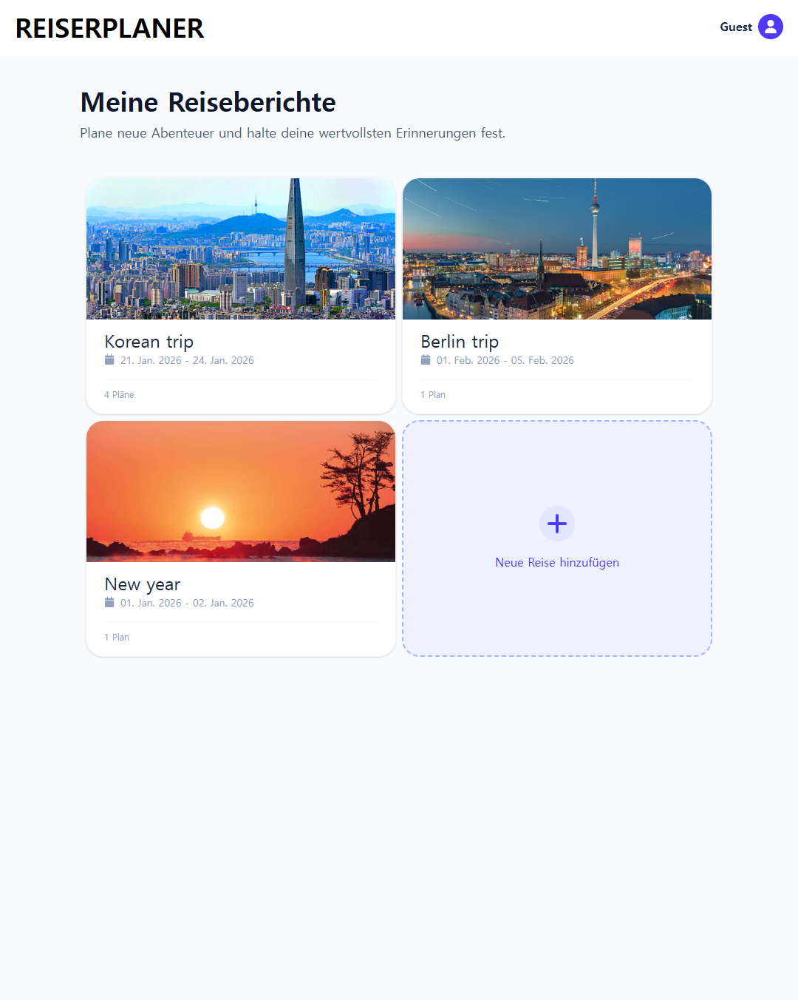
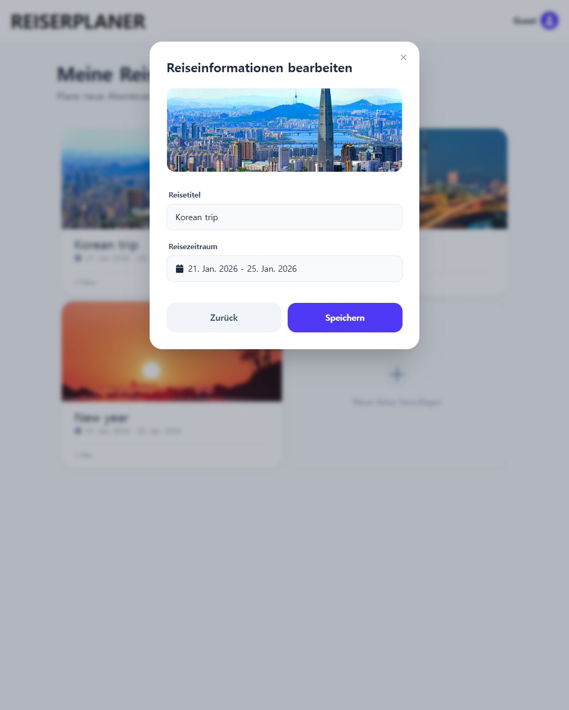
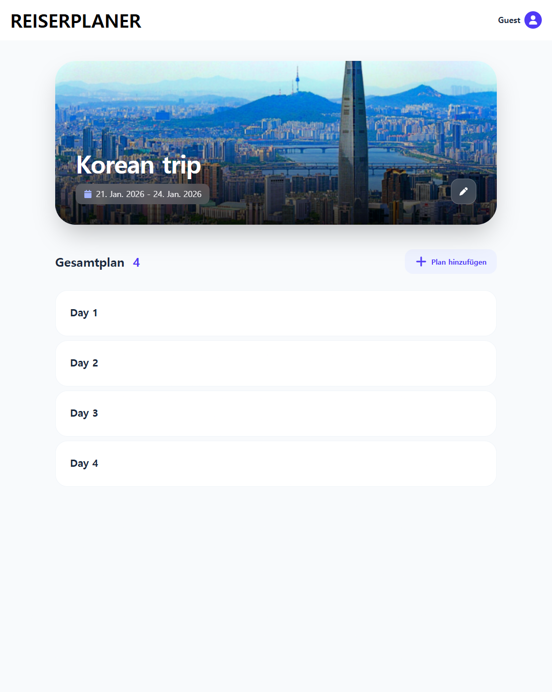
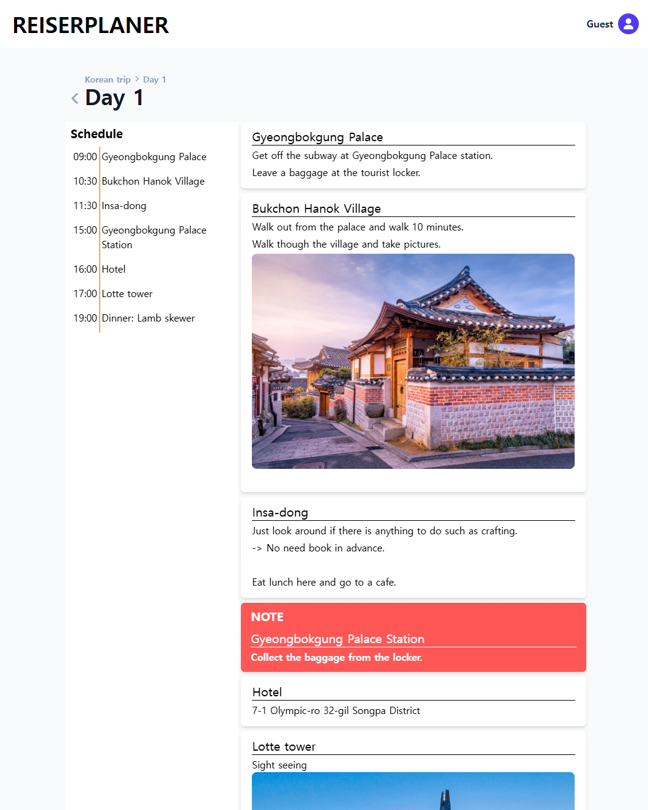
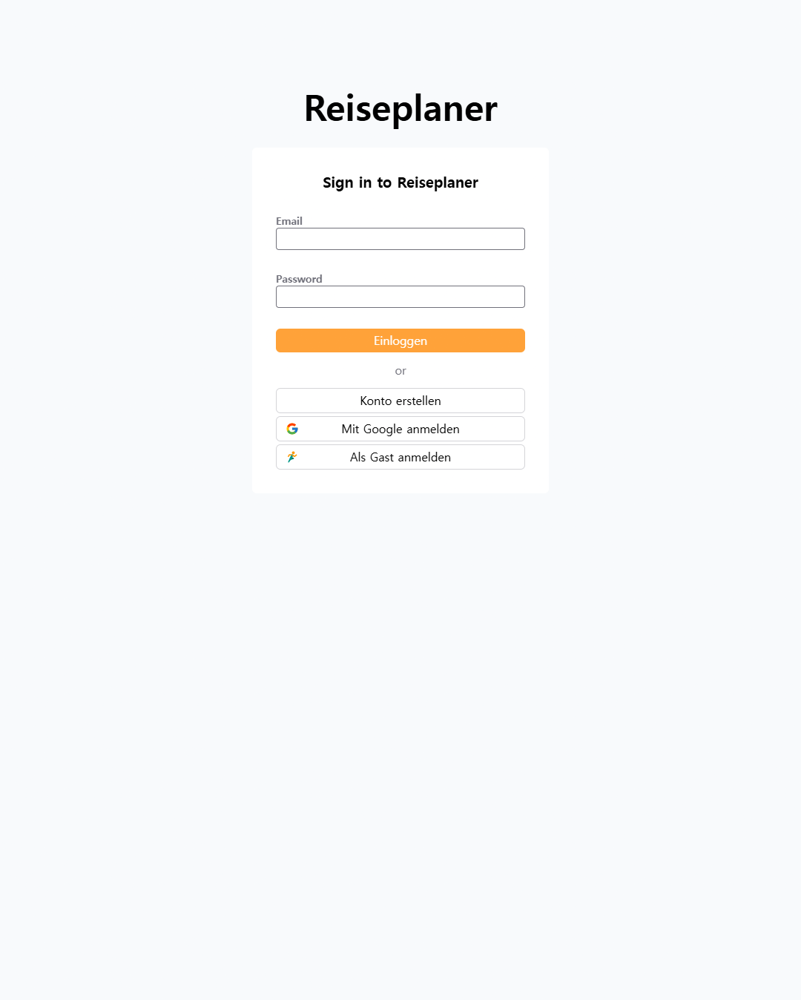
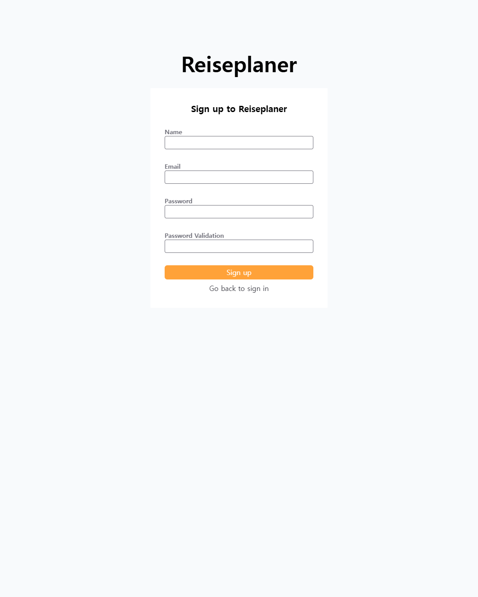

# Reiseplan - Simple Travel Planner

This project is a web service which helps you to make plans and schedules for a travel.<br/>
Site: [reiseplaner.org](https://reiseplaner.org/)

## Table of Contents

- [Overview](#overview)
- [Page Components](#page-components)
- [Tech Stacks](#tech-stacks)
- [Technical Challenges](#technical-challenges)
- [Getting Started](#getting-started)
- [Contact](#contact)

## Overview

### Project Info

Development Period: 18. 11. 2025 - 06. 01. 2026 (7 weeks)<br/>
Role: Frontend Developer (Individual Project)

### Problem

I used to write travel plans with Microsoft Excel. What I planed were simple: When and where I go. Sometimes I added pictures of what I would do.

Excel worked well for planning, but it was hard to use on a phone because it’s not optimized for mobile. I like to write plans on the desktop, but I will see the plans on the phone. So I decided to develop a web service Reiseplaner which I can use both on the desktop and on the phone.

### Solution

Reiseplaner provides intuitive UX through a simple UI. Users can create a plan group. This indicates a single travel. In the plan group, users can create plans. They can create plans per a day or per other criteria such as places. In the plan, users can schedule details of the plan. Schedules are displayed in time order, making it easy for users to check their schedules of a day. Users can add pictures or set a schedule to a important schedule, so that they don't miss out them later.

### Page Components

<table style="text-align: center;">
   <tr>
      <td>
         
      </td>
      <td>
         
      </td>
   </tr>
   <tr>
      <td>Main travel board</td>
      <td>Edit a travel info</td>
   </tr>
   <tr>
      <td>
         
      </td>
      <td>
         
      </td>
    </tr>
   <tr>
      <td>Plans of a travel</td>
      <td>Detail contents of a plan</td>
   </tr>
   <tr>
      <td>
         
      </td>
      <td>
         
      </td>
   </tr>
   <tr>
      <td>Sign-in (You can use a Guest ID as well!)</td>
      <td>Sign-up with an email</td>
   </tr>
   <tr>
      <td>
         
      </td>
      <td>
         
      </td>
    </tr>
   <tr>
      <td>Page not found</td>
      <td>Unhandled error</td>
   </tr>
</table>

## Tech Stacks

### Frontend

<div style="display: flex; flex-direction: column; gap: 10px; background-color: rgb(100, 100, 100, 0.5); border-radius: 8px; color: white; padding: 20px;">
<div style="display: flex; justify-content: space-around;">
<figure style="text-align: center; margin: 0;">

<figcaption>React 19</figcaption>
</figure>

<figure style="text-align: center; margin: 0;">

<figcaption>Tanstack Query 5</figcaption>
</figure>

<figure style="text-align: center; margin: 0;">

<figcaption>Tanstack Router</figcaption>
</figure>

<figure style="text-align: center; margin: 0;">

<figcaption>React Hook Form</figcaption>
</figure>

<figure style="text-align: center; margin: 0;">

<figcaption>Lexical</figcaption>
</figure>
</div>

<div style="display: flex; justify-content: space-around;">
<figure style="text-align: center; margin: 0;">

<figcaption>Typescript</figcaption>
</figure>

<figure style="text-align: center; margin: 0;">

<figcaption>Zod</figcaption>
</figure>

<figure style="text-align: center; margin: 0;">

<figcaption>Tailwind CSS</figcaption>
</figure>
</div>
</div>
<br/>

<b>React 19</b>

- `ref`: Passing `ref` as a parameter to use `useImperativeHandle` in the child component ([Usage](https://github.com/SeongjaeHong/Reiseplaner/blob/b4f61b075c13791e60d3d6639f5c5cb50793470f/src/components/planContents/components/DetailPlans/DetailPlans.tsx#L28))
- `ref cleanup`: Using `cleanup` in `callback ref` ([Cleanup](https://github.com/SeongjaeHong/Reiseplaner/blob/b4f61b075c13791e60d3d6639f5c5cb50793470f/src/utils/useClickOutside.tsx#L44), [Usage](https://github.com/SeongjaeHong/Reiseplaner/blob/b4f61b075c13791e60d3d6639f5c5cb50793470f/src/components/planGroup/edit/ThumbnailEdit.tsx#L53))
- `use`: Using `use` instead of `useContext` to match the future convention ([usage](https://github.com/SeongjaeHong/Reiseplaner/blob/b4f61b075c13791e60d3d6639f5c5cb50793470f/src/components/auth/AuthContext.tsx#L12))
- `Context`: Using `Context` without `Provider` ([usage](https://github.com/SeongjaeHong/Reiseplaner/blob/b4f61b075c13791e60d3d6639f5c5cb50793470f/src/components/auth/AuthProvider.tsx#L48))

<b>Tanstack Query 5</b>

- `useSuspenseQuery`: Display fallback components of Suspense by using `useSuspenseQuery` ([usage](https://github.com/SeongjaeHong/Reiseplaner/blob/b4f61b075c13791e60d3d6639f5c5cb50793470f/src/components/planContents/utils/contents.ts#L19), [Suspense](https://github.com/SeongjaeHong/Reiseplaner/blob/b4f61b075c13791e60d3d6639f5c5cb50793470f/src/components/planContents/PlanContents.tsx#L25))

<b>Tanstack Router</b>

- Ensures type safety by integrating Zod for strict URL search parameter validation.
- Simplifies complex route management and improves scalability through a file-based routing system.

<b>React Hook Form</b>

- Minimizes component re-renders by isolating form state from the parent component tree through uncontrolled components.

<b>Lexical</b>

- Maintained a lightweight bundle size while implementing rich-text features by only importing necessary nodes and plugins(Text, Image).

<b>Typescript + Zod</b>

- `TypeScript`: Ensured type safety and improve developer experience by catching potential errors during development rather than at runtime.
- `Zod`: Ensured types of user input and API responses are strictly adhere to expected formats.
- Reduced code redundancy by unifying TypeScript type definitions and validation logic using Zod schemas.

<b>Tailwind CSS</b>

- Reduced the need for maintaining separate, complex CSS files using Tailwind CSS’s utility classes and built-in responsive design features.

### Backend

<div style="display: flex; background-color: rgb(100, 100, 100, 0.5); border-radius: 8px; color: white; padding: 20px; justify-content: space-around;">
<figure style="text-align: center; margin: 0;">

<figcaption>Amazon CloudFront</figcaption>
</figure>

<figure style="text-align: center; margin: 0;">

<figcaption>Amazon S3</figcaption>
</figure>

<figure style="text-align: center; margin: 0;">

<figcaption>Supabase</figcaption>
</figure>
</div>
<br />

<b>Amazon CloudFront + S3</b>

- `S3`: Provided a reliable storage for the application's build files.
- `CloudFront`: Reduced global latency and improved loading speeds by caching content at edge locations closer to users.

<b>Supabase</b>

- Accelerated the development speed by utilizing its built-in features, including PostgreSQL database and Authentication.
- Simplified complex relational data management with its intuitive API, while ensuring real-time data synchronization for user plans.

## Technical Challenges

### 1. A race condition by automatic sign-out

Code: [AuthProvider.tsx](https://github.com/SeongjaeHong/Reiseplaner/blob/master/src/components/auth/AuthProvider.tsx)<br>

<b>Cause</b>

A race condition occurs because the `auto-sign-out` process and the `user-content-fetching` logic execute concurrently.

The Sequence of Failure:

- Revisit: A user returns with a remained session from their last visit.
- Trigger: auto-sign-out begins, but hasn't finished yet.
- Routing: The system sees the active session and navigates the user to the Main Page.
- Session Cleared: The sign-out completes right after page entry, setting the session to NULL.
- Data Fetch Fail: The app attempts to fetch user content from the DB, but since the session is now NULL, it returns nothing.
- Result: The user sees an empty page instead of being redirected to sign-in.

<b>Solution</b>

To fix the race condition, I introduced a synchronization flag called `sign-out-ref`.

- [Revisit](https://github.com/SeongjaeHong/Reiseplaner/blob/931e06fd9dd3478cb53402248c3caaf7f6b4c323/src/components/auth/AuthProvider.tsx#L20): The moment the auto-sign-out starts, set `sign-out-ref` to `true`.
- [Session Retrieve](https://github.com/SeongjaeHong/Reiseplaner/blob/931e06fd9dd3478cb53402248c3caaf7f6b4c323/src/components/auth/AuthProvider.tsx#L49): Even if the session still exists, the AuthProvider checks this flag first. If the flag is `true`, it ignores the existing session and treats the user as already logged out (`null`).
- Result: This prevents the app from trying to fetch user data prematurely. It ensures the system stays in a "signed-out" state until the `sign-out` is complete, eliminating the empty page error.

### 2. High network latency caused by high-resolution images

Code: [buckets.ts](https://github.com/SeongjaeHong/Reiseplaner/blob/master/src/apis/supabase/buckets.ts)

<b>Cause</b>

Since users can upload images of any format and size, large image files were causing significant performance bottlenecks.

- Storage Waste: High-resolution images, intended only for simple display, occupied unnecessary database storage.
- Latency Issue: Loading several unoptimized images (over several MBs each) on a single page resulted in high network latency and a poor user experience.

<b>Solution</b>

I implemented a client-side image pre-processing pipeline before the upload phase to optimize resource delivery.

- [Resizing](https://github.com/SeongjaeHong/Reiseplaner/blob/931e06fd9dd3478cb53402248c3caaf7f6b4c323/src/apis/supabase/buckets.ts#L15): Images are automatically resized to a maximum of 700px on their longest side while maintaining the original aspect ratio.
- [Format Conversion](https://github.com/SeongjaeHong/Reiseplaner/blob/931e06fd9dd3478cb53402248c3caaf7f6b4c323/src/apis/supabase/buckets.ts#L19): All images are converted to WebP format, which provides superior compression compared to JPEG/PNG.
- Result: This optimization reduced the average file size by over 80%, leading to an improvement in image loading speeds of more than 200% and significant savings in storage costs.

### 3. Frequent Image request to the Supabase Server

Code: [ImageComponent.tsx](https://github.com/SeongjaeHong/Reiseplaner/blob/931e06fd9dd3478cb53402248c3caaf7f6b4c323/src/components/planContents/components/Editor/ImageComponent.tsx#L29)

<b>Cause</b>

Plan contents are stored as text in the database, with images referenced via Storage URLs. This led to inefficient data fetching patterns:

- Redundant Requests: Even when the plan's text content was cached in the browser, the browser had to initiate separate HTTP requests to the Supabase bucket for every image URL embedded in the content.
- Flickering UI: Each time a user re-visited a plan, the text would appear instantly (via cache), but images would "pop in" later as they were re-downloaded from the server.

<b>Solution</b>

To minimize redundant network traffic and improve the visual experience, I integrated TanStack Query to manage image data caching independently.

- [Separate Caching Strategy](https://github.com/SeongjaeHong/Reiseplaner/blob/master/src/utils/useFetchImage.ts): Instead of relying on raw URL loading, I implemented a logic to fetch image data and cache it using TanStack Query’s useQuery with staleTime configuration.
- Persistent State: By treating image assets as cached resources, the application avoids redundant requests to the Supabase server for already-viewed images.
- Result: Reduced the number of server requests for repetitive views and ensured a "flicker-free" UI by retrieving images directly from the client-side cache.

# Getting Started

```shell
# Clone this project
git clone git@github.com:SeongjaeHong/Reiseplaner.git

# Instasll dependencies
cd Reiseplaner
pnpm install

# Run this project
pnpm dev

# Or you can just build it
pnpm build
pnpm preview
```

# Contact

Name: Seongaje Hong<br/>
Email: sjhong310@gmail.com<br/>
LinkedIn: https://www.linkedin.com/in/sj-hong/
